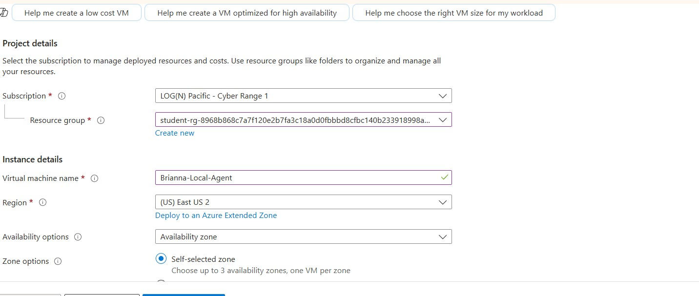
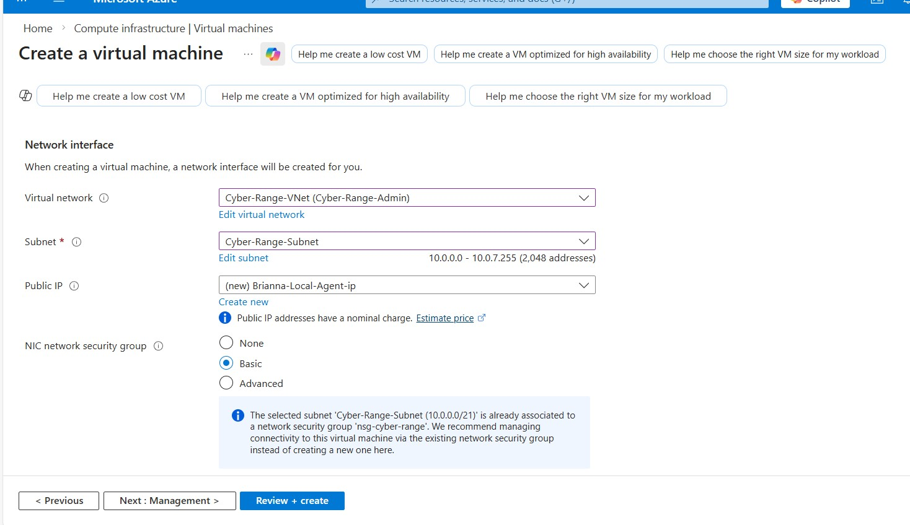
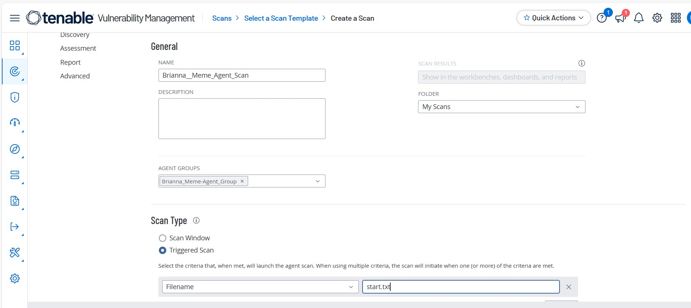
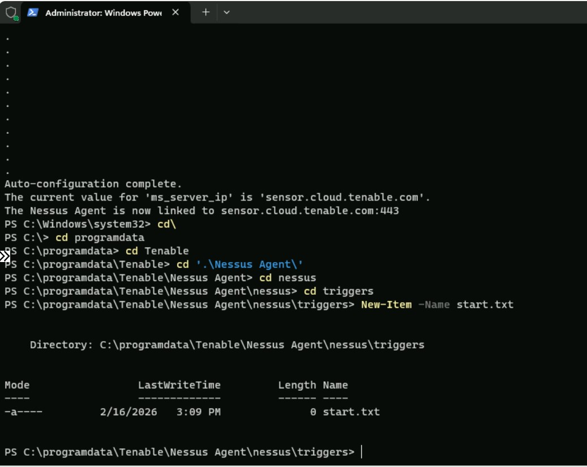

# Windows 11 Agent-Based Vulnerability Monitoring (Tenable)

## Project Overview

This project demonstrates **agent-based vulnerability monitoring** on a **Windows 11 virtual machine** using **Tenable Vulnerability Management** and the **Nessus Agent** deployed in a **Microsoft Azure** environment.  

Unlike network-based scans, this approach leverages a **locally installed agent** to continuously assess system vulnerabilities, providing deeper visibility into endpoint security posture, patch compliance, and application-level risks.

The project focuses on identifying **real-world, high-impact vulnerabilities** and translating findings into actionable remediation strategies aligned with **security operations, compliance, and risk management** practices.

---

## Objectives

- Deploy a Windows 11 virtual machine in Azure
- Install and link a Nessus Agent to Tenable
- Configure an **agent-based triggered scan**
- Identify endpoint vulnerabilities and misconfigurations
- Analyze findings through a risk and compliance lens
- Propose remediation strategies to reduce attack surface

---

## Environment & Architecture

- **Cloud Platform:** Microsoft Azure  
- **Operating System:** Windows 11 Pro (x64)  
- **Vulnerability Platform:** Tenable Vulnerability Management  
- **Scan Type:** Basic Agent Scan (Triggered)  
- **Sensor:** Nessus Agent (Local)  

  
  
  

---

## Agent Deployment & Configuration

A Nessus Agent was provisioned directly on the Windows 11 VM and linked to Tenable Cloud.  
The scan was configured as a **triggered agent scan**, initiated by creating a `start.txt` file in the agent’s trigger directory.

This method simulates how organizations perform **continuous endpoint monitoring** without relying on exposed network services.

  
  

---

## Scan Execution

- Nessus Agent successfully linked to Tenable
- Agent assigned to a dedicated Agent Group
- Triggered scan initiated via local file creation
- Scan results populated after agent check-in

  
  

---

## Key Vulnerabilities Identified

The agent-based scan identified multiple **high-risk and exploitable vulnerabilities**, primarily related to **outdated applications and missing security updates**.

### Notable Findings
- **Microsoft Teams for Desktop < 25122.1415.3698.6812** – Remote Code Execution (August 2025)
- **Microsoft Teams for Desktop < 25163.3611.3774.6315** – Elevation of Privilege (July 2025)
- **Microsoft Windows Notepad < 11.2510** – Command Injection (February 2026)
- **Security Updates for Outlook for Windows** – Missing April 2024 patches
- **Windows Defender Antimalware Signature Definitions** – Out of date
- **WinVerifyTrust Signature Validation (CVE-2013-3900)** – Mitigation not enabled

These findings demonstrate how endpoint software drift and delayed patching can significantly increase organizational risk.

---

## Risk & Impact Analysis

The identified vulnerabilities introduce the following risks:

- **Remote Code Execution (RCE):** Enables attackers to execute arbitrary code
- **Privilege Escalation:** Allows local users or malware to gain elevated access
- **Application-Level Exploits:** Increases exposure through commonly used software
- **Reduced Endpoint Compliance:** Weakens audit readiness and baseline enforcement

From a compliance and governance perspective, these issues highlight the importance of **continuous endpoint monitoring** rather than periodic network-only scans.

---

## Solutions & Remediation Recommendations

### 1. Patch & Update Management

**Issues**
- Outdated Microsoft Teams, Outlook, and Notepad versions
- Missing Windows security updates

**Solutions**
- Apply all pending Windows Updates
- Update Microsoft Teams and Outlook to the latest supported versions
- Enforce automated patching for third-party applications
- Validate remediation with follow-up agent scans

---

### 2. Endpoint Protection & Antivirus

**Issues**
- Outdated Windows Defender signature definitions

**Solutions**
- Force antivirus definition updates
- Ensure real-time protection is enabled
- Monitor AV status via continuous agent-based scanning

---

### 3. Secure Software Validation

**Issues**
- WinVerifyTrust CVE-2013-3900 mitigation not enabled

**Solutions**
- Enable `EnableCertPaddingCheck` to enforce proper certificate validation
- Apply Microsoft-recommended cryptographic hardening settings
- Re-scan to confirm mitigation enforcement

---

### 4. Continuous Monitoring & Governance

**Practices**
- Maintain Nessus Agents on critical endpoints
- Schedule regular or triggered agent scans
- Track vulnerability trends over time
- Integrate findings into patch and risk management workflows
- Maintain evidence for audit and compliance reporting

---

## Key Takeaways

This project demonstrates the value of **agent-based vulnerability monitoring** for endpoint security. By using a locally installed agent, deeper visibility was achieved into application-level risks and patch compliance that may be missed by traditional network scans.

### Skills Demonstrated
- Agent-based vulnerability monitoring
- Endpoint security assessment
- Patch and application risk analysis
- Tenable Nessus Agent deployment
- Compliance and risk-focused remediation planning

---

